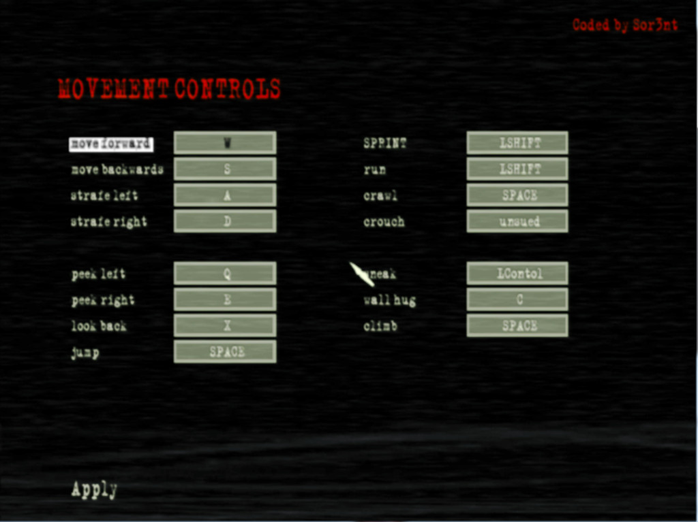
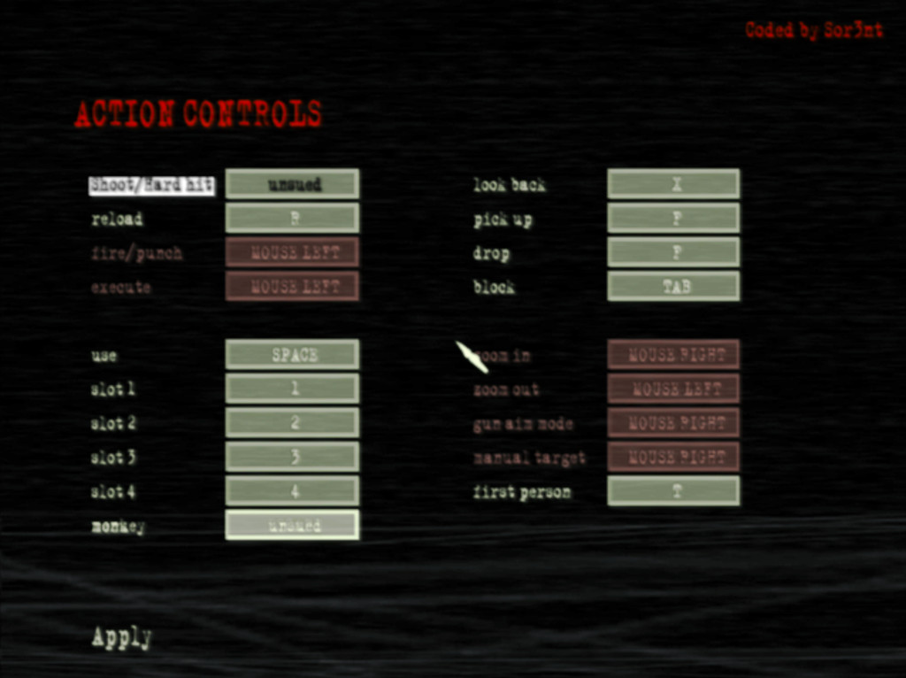

# Manhunt 2 Keyboard mapper

> Replace the current control page with a changeable version.
## Installation

Place the Manhunt2.Keyboard.asi inside the Manhunt2 folder.

You will also need Ultimate-ASI-Loader
https://github.com/ThirteenAG/Ultimate-ASI-Loader/releases

## Screenshots

# Credits
 
* **Sor3nt**

 
 
 